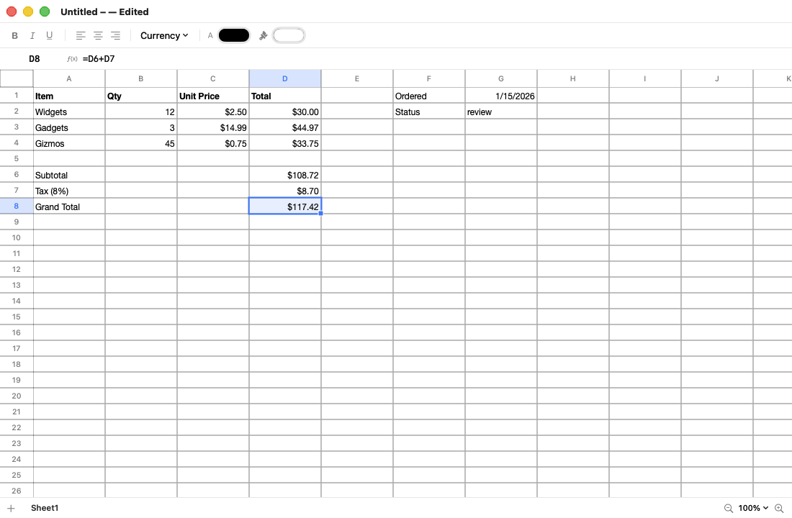

# SimpleSpread

A native macOS spreadsheet app written entirely in Swift. Native file format
is XLSX; CSV imports and exports. The formula engine covers Google Sheets'
core feature set — 156 functions, real coercion semantics, incremental
recalculation. The spreadsheet stack (model, formula engine, XLSX/ZIP/CSV I/O,
grid) is built from scratch with no third-party libraries; the sole external
dependency is [Sparkle](https://sparkle-project.org) for software updates.




## Features

- **XLSX native**: reads and writes OOXML SpreadsheetML interoperable with
  Excel, Numbers, and Google Sheets — including a from-scratch ZIP layer,
  shared strings, styles, number formats, formulas with cached values,
  merged ranges, frozen panes, and 1904-date-system normalization on read.
- **CSV done right**: delimiter sniffing, BOM/CP1252 encoding detection,
  quote-aware parsing, injection-safe import (a `=cmd` field is data, not a
  formula), leading-zero preservation, and RFC 4180 export with UTF-8 BOM,
  CRLF, full-precision numbers, and ISO dates.
- **Formula engine**: full operator set with Excel precedence (`-2^2 = 4`,
  `2^3^2 = 64`), Sheets-compatible type coercion and comparison ranking,
  SUMIF/COUNTIF criteria with wildcards, lazy IF, cross-sheet references,
  whole-row/column ranges, volatile functions, cycle detection, and
  iterative solvers for IRR/RATE/XIRR. See [docs/FUNCTIONS.md](docs/FUNCTIONS.md).
- **Spreadsheet-grade editing**: Excel's Ready/Enter/Edit state machine,
  type-to-replace, F2/double-click in-place editing, Cmd+arrow data-edge
  jumps, header selection and resizing with autofit, fill handle with
  formula translation, Fill Down / Fill Right (⌘D / ⌘R), Clear Formatting
  (⌘\), lossless internal clipboard plus TSV interop, and per-gesture undo —
  including undo of row/column/sheet operations.
- **Navigation**: Find (⌘F) with match navigation (⌘G / ⇧⌘G), a name box for
  jump-to-cell, and view zoom from 25%–400% (⌘+/⌘−/⌘0, status-bar control,
  and trackpad pinch).
- **File handling**: Open Recent (File menu) that actually reopens files under
  the sandbox via security-scoped bookmarks, Finder/`open` file association,
  and CSV/TSV/TXT import that forces Save-As to XLSX.
- **Software updates**: in-place auto-update via [Sparkle](https://sparkle-project.org),
  driven by GitHub Releases — a "Check for Updates…" menu item, automatic
  background checks, and one-click download-verify-replace-relaunch. See
  [docs/UPDATES.md](docs/UPDATES.md) for the signing-key and release setup.
- **Formatting**: bold/italic/underline/strikethrough, colors, alignment,
  and the number-format menu (automatic, number, percent, currency, date,
  time, scientific, plain text) backed by a full Excel format-code renderer.

## Building

Requires Xcode 16+ on macOS 14+.

```bash
swift build            # debug build
swift test             # 312 tests
swift run SimpleSpread # run the app directly
./scripts/build-app.sh # assemble SimpleSpread.app + DMG (ad-hoc signed)
```

## Documentation

- [docs/PLAN.md](docs/PLAN.md) — architecture, module map, design decisions,
  testing strategy, roadmap.
- [docs/RESEARCH.md](docs/RESEARCH.md) — the feature-set research (formula
  semantics, XLSX internals, editing UX, CSV) the implementation follows.
- [docs/FUNCTIONS.md](docs/FUNCTIONS.md) — all 156 functions with semantics
  notes and known deviations.

## CI & releases

- **CI** (`.github/workflows/ci.yml`): every push/PR builds and runs the
  test suite on macOS 15, then boots the real app headlessly and captures a
  window render as an artifact.
- **Release** (`.github/workflows/build.yml`): manual dispatch with a
  version number → tests → arm64 release build → .app assembly → signing →
  DMG → optional notarization → GitHub Release. Signing/notarization use
  the repository secrets `APPLE_CERTIFICATE`, `APPLE_CERTIFICATE_PASSWORD`,
  `APPLE_SIGNING_IDENTITY`, `APPLE_ID`, `APPLE_PASSWORD`, and
  `APPLE_TEAM_ID`; without them the DMG is ad-hoc signed.

## Debug hooks

```bash
SIMPLESPREAD_DEMO=1 swift run SimpleSpread            # seed demo content
SIMPLESPREAD_SCREENSHOT=/tmp/win.png swift run SimpleSpread  # render window to PNG and exit
SIMPLESPREAD_OPEN=/path/file.csv swift run SimpleSpread      # drive the real open→window flow
SIMPLESPREAD_ZOOM=1.5 SIMPLESPREAD_DEMO=1 swift run SimpleSpread  # launch at a zoom level
SIMPLESPREAD_FIND=term SIMPLESPREAD_DEMO=1 swift run SimpleSpread # open the find bar on a term
SIMPLESPREAD_SAMPLE_DIR=/tmp swift test --filter SampleFileGeneration  # emit sample .xlsx/.csv
```
